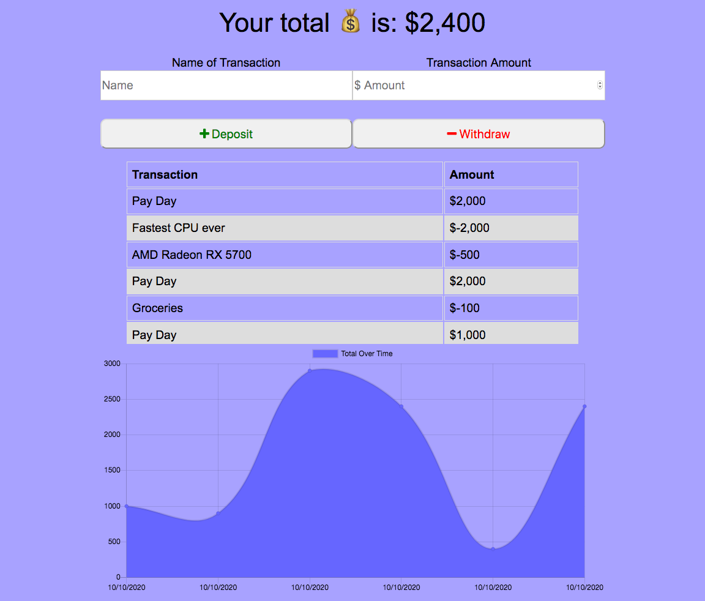

# Budget Tracker

### Powered By
 
    

## Description 

Track your budget with a reliable application. Featured with offline capabilities to use with help of IndexedDb and a custom built serviceWorker file. 

Also full PWA capabilities so you can install it to your homescreen on your iphone, android, or desktop computer as if it were a full fledged standalone application!

## Table of Contents
* [Usage](#Usage)
* [Credits](#Credits)
* [License](#License)
* [Questions](#Questions)

## Usage

* 👇 Click the badge to check out how it works at the Heroku Deployed Application!
* 

## Credits

* Anders Ackerman
* [Xandromus](https://github.com/Xandromus)
* My Three Cats!

## License

Budget Tracker is licensed under the MIT license.

## Questions

If anybody has any questions please reach out to the creator of the project - Anders Ackerman via:
* Email: anders.swedishviking@gmail.com
* GitHub: (https://github.com/dj-viking)
